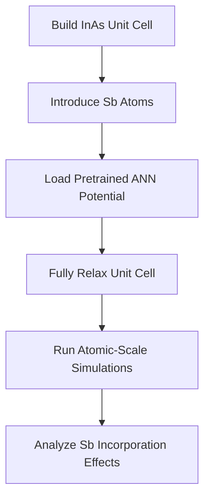

# InAsSb_atomic_structures
To investigate the effect of Sb incorporation into the InAs crystal structure 
at the atomic level, we used artificial neural network based potentials.

https://github.com/inholeegithub/InAsSb_atomic_structures.git

## Workflow Overview

